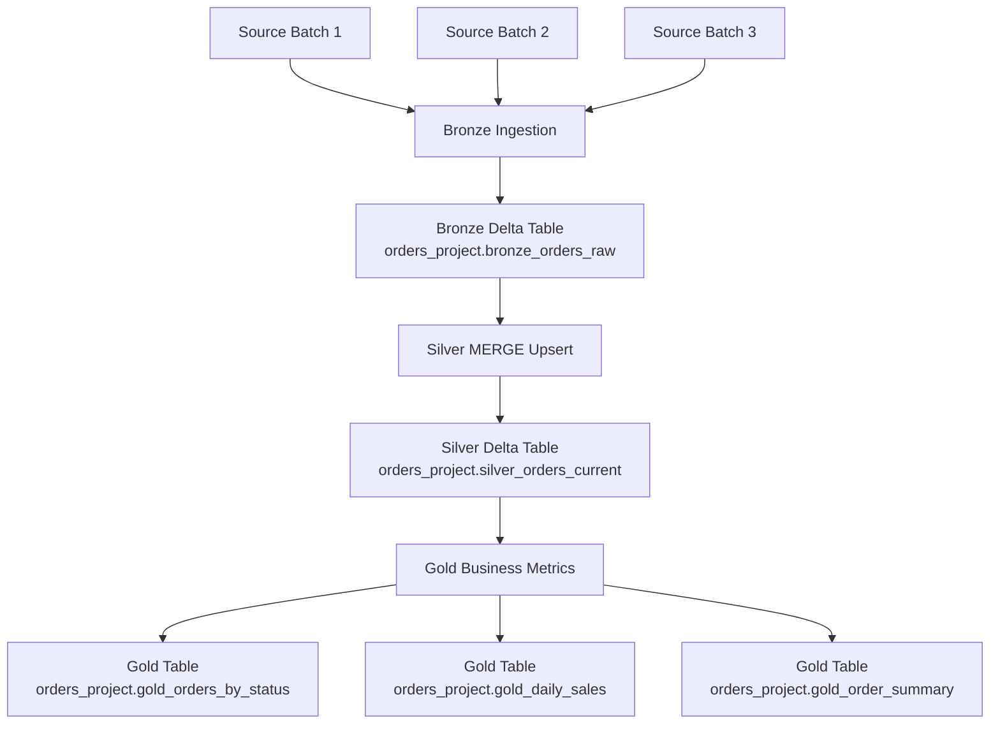
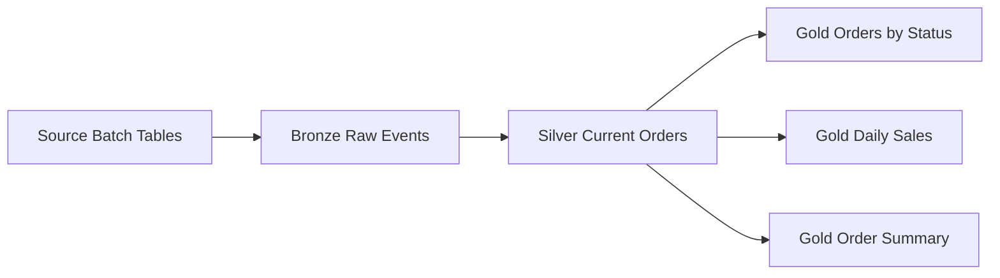
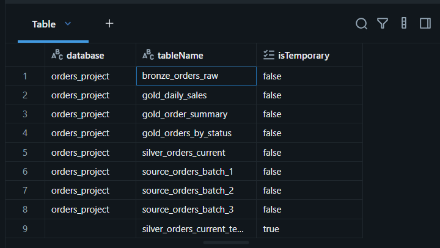
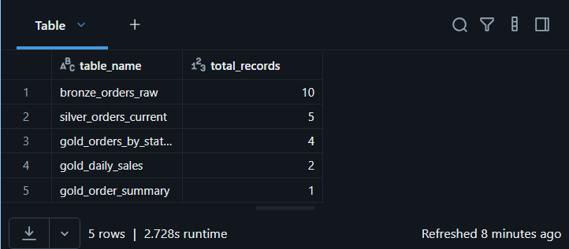
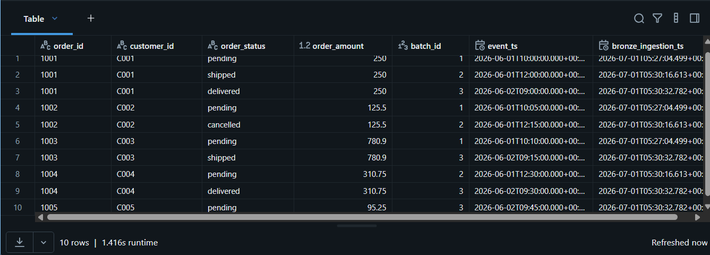
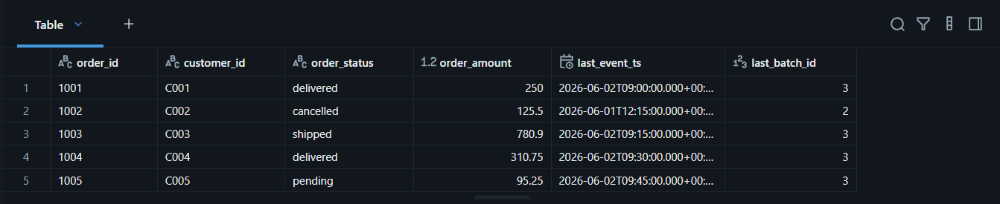
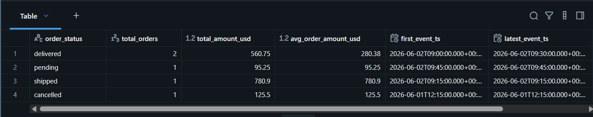
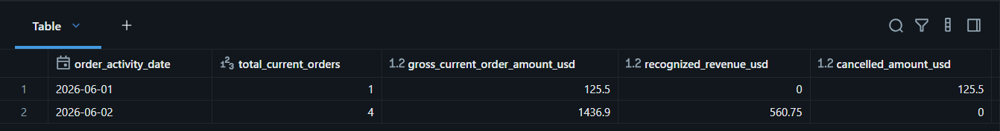
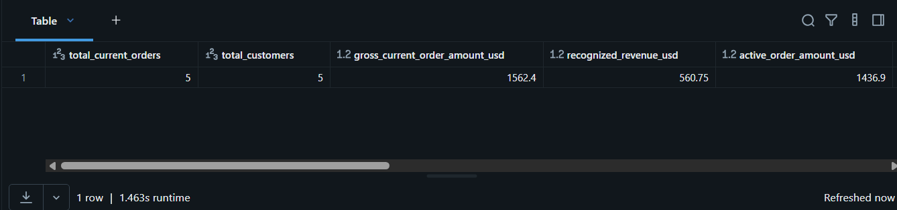
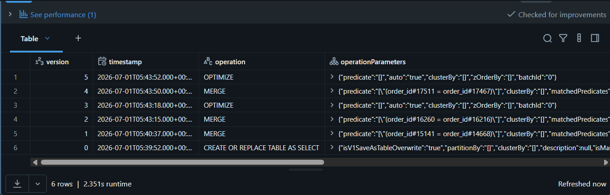

# Architecture Documentation — Incremental Orders Pipeline with Delta Lake MERGE

## 1. Purpose of This Document

This document explains the technical architecture of the **Incremental Orders Pipeline with Delta Lake MERGE**, a data engineering project built with **Databricks Free Edition**, **Apache Spark**, **PySpark**, **Spark SQL**, and **Delta Lake**.

The project simulates an e-commerce order processing system where order events arrive in multiple batches. Some events are new orders, while others are updates to existing orders.

The core goal of this architecture is to demonstrate how to process incremental data and maintain a reliable current-state table using **Delta Lake `MERGE INTO`**.

---

## 2. High-Level Architecture

The pipeline follows a Medallion-style architecture:

```text
Bronze → Silver → Gold
```

Each layer has a specific responsibility:

| Layer  | Responsibility                                  |
| ------ | ----------------------------------------------- |
| Bronze | Store all raw incoming order events             |
| Silver | Maintain the latest current state of each order |
| Gold   | Create business metrics and executive summaries |

---

## 3. Architecture Diagram



---

## 4. Business Context

An e-commerce company receives order events from an operational order management system.

An order may change status over time:

```text
pending → shipped → delivered
```

or:

```text
pending → cancelled
```

The source system sends events in batches. Some batches contain new orders, and others contain updates for existing orders.

Example:

| order_id | order_status | event_ts            |
| -------- | ------------ | ------------------- |
| 1001     | pending      | 2026-06-01 10:00:00 |
| 1001     | shipped      | 2026-06-01 12:00:00 |
| 1001     | delivered    | 2026-06-02 09:00:00 |

The business needs two views:

1. A full historical event log.
2. A current-state table with the latest status of each order.

This project solves that using Bronze, Silver, Gold, and Delta Lake `MERGE INTO`.

---

## 5. Data Source Design

This project uses synthetic source batches to simulate incremental data arrival.

The source batch tables are:

```text
orders_project.source_orders_batch_1
orders_project.source_orders_batch_2
orders_project.source_orders_batch_3
```

The batches simulate a realistic order lifecycle.

---

## 6. Source Batch 1

Batch 1 contains initial new orders.

| order_id | customer_id | order_status | order_amount |
| -------- | ----------- | ------------ | -----------: |
| 1001     | C001        | pending      |       250.00 |
| 1002     | C002        | pending      |       125.50 |
| 1003     | C003        | pending      |       780.90 |

At this stage, all orders are new.

---

## 7. Source Batch 2

Batch 2 contains updates and a new order.

| order_id | customer_id | order_status | order_amount |
| -------- | ----------- | ------------ | -----------: |
| 1001     | C001        | shipped      |       250.00 |
| 1002     | C002        | cancelled    |       125.50 |
| 1004     | C004        | pending      |       310.75 |

Batch 2 introduces two updates:

```text
1001: pending → shipped
1002: pending → cancelled
```

And one new order:

```text
1004: pending
```

---

## 8. Source Batch 3

Batch 3 contains more updates and a new order.

| order_id | customer_id | order_status | order_amount |
| -------- | ----------- | ------------ | -----------: |
| 1001     | C001        | delivered    |       250.00 |
| 1003     | C003        | shipped      |       780.90 |
| 1004     | C004        | delivered    |       310.75 |
| 1005     | C005        | pending      |        95.25 |

Batch 3 introduces these changes:

```text
1001: shipped → delivered
1003: pending → shipped
1004: pending → delivered
1005: new pending order
```

---

## 9. Final Expected State

After processing all three batches, Bronze should contain all 10 events.

Silver should contain only 5 unique current orders.

Expected Silver current state:

| order_id | final_status | last_batch_id |
| -------- | ------------ | ------------: |
| 1001     | delivered    |             3 |
| 1002     | cancelled    |             2 |
| 1003     | shipped      |             3 |
| 1004     | delivered    |             3 |
| 1005     | pending      |             3 |

This proves that the pipeline correctly processed updates and inserts.

---

# 10. Bronze Layer

## 10.1 Purpose

The Bronze layer stores all incoming order events using append logic.

It represents the raw historical event log.

Bronze does not decide which status is correct or latest. It simply preserves what arrived from the source system.

---

## 10.2 Bronze Table

```text
orders_project.bronze_orders_raw
```

---

## 10.3 Bronze Responsibilities

The Bronze layer is responsible for:

* Reading source batch tables.
* Adding ingestion metadata.
* Appending events into a Delta table.
* Preserving all historical events.
* Avoiding duplicate ingestion of the same batch.

---

## 10.4 Bronze Columns

| Column                | Description                                            |
| --------------------- | ------------------------------------------------------ |
| `batch_id`            | Batch identifier                                       |
| `order_id`            | Unique order identifier                                |
| `customer_id`         | Customer identifier                                    |
| `order_status`        | Status received from the source event                  |
| `order_amount`        | Order amount in USD                                    |
| `event_ts`            | Timestamp when the event happened in the source system |
| `source_system`       | Source system name                                     |
| `bronze_ingestion_ts` | Timestamp when the record was ingested into Bronze     |
| `source_batch_table`  | Source table used for the ingestion                    |

---

## 10.5 Bronze Write Pattern

Bronze uses append mode:

```python
bronze_df.write \
    .format("delta") \
    .mode("append") \
    .saveAsTable("orders_project.bronze_orders_raw")
```

---

## 10.6 Why Bronze Uses Append

Bronze must keep all events because historical events are valuable for:

* Auditing
* Debugging
* Data lineage
* Reprocessing
* Historical analysis
* Understanding order lifecycle changes

For example, order `1001` appears three times in Bronze:

| order_id | order_status |
| -------- | ------------ |
| 1001     | pending      |
| 1001     | shipped      |
| 1001     | delivered    |

This is correct because Bronze is the event history.

---

## 10.7 Bronze Idempotency Check

The Bronze notebook checks whether a batch has already been ingested before appending it again.

Conceptual logic:

```text
If batch_id already exists in Bronze:
    skip append

If batch_id does not exist in Bronze:
    append batch
```

This prevents duplicate records when the notebook is accidentally executed more than once for the same batch.

---

# 11. Silver Layer

## 11.1 Purpose

The Silver layer maintains the current state of each order.

Unlike Bronze, Silver does not keep every historical event. Instead, it keeps only the latest known version of each `order_id`.

This makes Silver suitable for current operational analytics.

---

## 11.2 Silver Table

```text
orders_project.silver_orders_current
```

---

## 11.3 Silver Responsibilities

The Silver layer is responsible for:

* Reading incremental events from Bronze.
* Processing one batch at a time.
* Deduplicating events by `order_id`.
* Selecting the latest event based on `event_ts`.
* Updating existing orders.
* Inserting new orders.
* Preventing older events from overwriting newer events.

---

## 11.4 Silver Columns

| Column                | Description                                    |
| --------------------- | ---------------------------------------------- |
| `order_id`            | Unique order identifier                        |
| `customer_id`         | Customer identifier                            |
| `order_status`        | Latest known order status                      |
| `order_amount`        | Order amount in USD                            |
| `last_event_ts`       | Timestamp of the latest source event           |
| `last_batch_id`       | Batch that produced the latest state           |
| `source_system`       | Source system name                             |
| `source_batch_table`  | Source table of the latest event               |
| `bronze_ingestion_ts` | Bronze ingestion timestamp of the latest event |
| `silver_processed_ts` | Timestamp when Silver processed the record     |

---

# 12. Delta Lake MERGE INTO

## 12.1 What Is MERGE INTO?

`MERGE INTO` is a Delta Lake operation used to apply changes from a source dataset into a target table.

It allows the pipeline to perform an upsert.

```text
UPSERT = UPDATE + INSERT
```

In this project:

```text
If order_id exists in Silver:
    update it only if the incoming event is newer.

If order_id does not exist in Silver:
    insert it as a new order.
```

---

## 12.2 Why MERGE INTO Is Important

In real data platforms, operational data usually arrives incrementally.

Rebuilding an entire table every time may be expensive or inefficient.

`MERGE INTO` allows the pipeline to process only new incoming records while maintaining an accurate target table.

This is closer to real-world data engineering.

---

## 12.3 MERGE Logic Used

```sql
MERGE INTO orders_project.silver_orders_current AS target
USING silver_updates_temp AS source
ON target.order_id = source.order_id

WHEN MATCHED AND source.last_event_ts > target.last_event_ts THEN
  UPDATE SET
    target.customer_id = source.customer_id,
    target.order_status = source.order_status,
    target.order_amount = source.order_amount,
    target.last_event_ts = source.last_event_ts,
    target.last_batch_id = source.last_batch_id,
    target.source_system = source.source_system,
    target.source_batch_table = source.source_batch_table,
    target.bronze_ingestion_ts = source.bronze_ingestion_ts,
    target.silver_processed_ts = source.silver_processed_ts

WHEN NOT MATCHED THEN
  INSERT (
    order_id,
    customer_id,
    order_status,
    order_amount,
    last_event_ts,
    last_batch_id,
    source_system,
    source_batch_table,
    bronze_ingestion_ts,
    silver_processed_ts
  )
  VALUES (
    source.order_id,
    source.customer_id,
    source.order_status,
    source.order_amount,
    source.last_event_ts,
    source.last_batch_id,
    source.source_system,
    source.source_batch_table,
    source.bronze_ingestion_ts,
    source.silver_processed_ts
  )
```

---

## 12.4 Match Condition

The match condition is:

```sql
ON target.order_id = source.order_id
```

This means that `order_id` is the business key used to identify whether an incoming event belongs to an existing order.

---

## 12.5 Update Condition

The update condition is:

```sql
WHEN MATCHED AND source.last_event_ts > target.last_event_ts THEN UPDATE
```

This protects the Silver table from older events.

An incoming event can update Silver only when its timestamp is newer than the current record.

---

## 12.6 Insert Condition

The insert condition is:

```sql
WHEN NOT MATCHED THEN INSERT
```

This handles new orders that do not exist in Silver yet.

---

# 13. Deduplication Strategy

## 13.1 Why Deduplication Is Needed

In real systems, a single batch may contain multiple records for the same `order_id`.

Example:

| order_id | order_status | event_ts            |
| -------- | ------------ | ------------------- |
| 1001     | shipped      | 2026-06-01 12:00:00 |
| 1001     | delivered    | 2026-06-01 12:05:00 |

Sending both records directly into a `MERGE` can create ambiguity.

The pipeline should first keep only the latest event per `order_id`.

---

## 13.2 Deduplication Logic

The project uses a window function:

```python
dedup_window = Window.partitionBy("order_id").orderBy(col("event_ts").desc())

silver_updates_df = (
    bronze_batch_df
    .withColumn("row_num", row_number().over(dedup_window))
    .filter(col("row_num") == 1)
    .drop("row_num")
)
```

This means:

```text
For each order_id:
    sort records by event_ts descending.
    keep only row number 1.
```

---

## 13.3 Result of Deduplication

If a batch contains:

| order_id | order_status | event_ts            |
| -------- | ------------ | ------------------- |
| 1001     | shipped      | 2026-06-01 12:00:00 |
| 1001     | delivered    | 2026-06-01 12:05:00 |

Silver receives only:

| order_id | order_status | event_ts            |
| -------- | ------------ | ------------------- |
| 1001     | delivered    | 2026-06-01 12:05:00 |

---

# 14. Incremental Processing

## 14.1 What Is Incremental Processing?

Incremental processing means that the pipeline processes only new or changed data instead of rebuilding everything from scratch.

In this project, each batch is processed independently.

```text
Batch 1 → process only batch 1
Batch 2 → process only batch 2
Batch 3 → process only batch 3
```

Bronze accumulates events.

Silver applies changes through `MERGE`.

Gold recalculates business metrics from the current Silver state.

---

## 14.2 Why Incremental Processing Matters

Incremental processing is important because it helps:

* Reduce processing time
* Avoid unnecessary recomputation
* Handle continuously arriving data
* Support operational analytics
* Scale better with larger datasets

---

## 14.3 Incremental vs Full Refresh

| Approach               | Description                     | Use Case                                           |
| ---------------------- | ------------------------------- | -------------------------------------------------- |
| Full refresh           | Rebuilds the entire table       | Small datasets or simple transformations           |
| Incremental processing | Processes only new/changed data | Operational systems, event streams, large datasets |

This project uses incremental logic in Bronze and Silver.

---

# 15. Idempotency

## 15.1 What Is Idempotency?

An idempotent pipeline can be safely re-run without creating incorrect results.

For example, if batch 2 is accidentally processed twice, the final result should not duplicate records or corrupt the Silver table.

---

## 15.2 Idempotency in Bronze

Bronze checks whether a batch already exists before appending.

Conceptual logic:

```text
If batch already exists:
    skip ingestion

If batch does not exist:
    append ingestion
```

This prevents duplicate raw events.

---

## 15.3 Idempotency in Silver

Silver uses `MERGE INTO`.

If a record already exists and the incoming event is not newer, it does not update the target record.

This condition helps protect the current-state table:

```sql
source.last_event_ts > target.last_event_ts
```

---

# 16. Late-Arriving and Out-of-Order Events

## 16.1 What Is a Late-Arriving Event?

A late-arriving event is an older event that arrives after a newer event has already been processed.

Example:

| Arrival Order | order_id | status    | event_ts            |
| ------------- | -------- | --------- | ------------------- |
| 1             | 1001     | delivered | 2026-06-02 09:00:00 |
| 2             | 1001     | shipped   | 2026-06-01 12:00:00 |

The `shipped` event arrives late, but it is older than `delivered`.

---

## 16.2 How This Project Handles It

The Silver MERGE condition prevents older events from overwriting newer ones:

```sql
WHEN MATCHED AND source.last_event_ts > target.last_event_ts THEN UPDATE
```

This means the late `shipped` event would not overwrite the current `delivered` state.

---

# 17. Gold Layer

## 17.1 Purpose

The Gold layer creates business-ready metrics from the Silver current-state table.

Gold is designed for reporting, dashboards, and business users.

---

## 17.2 Gold Tables

The project creates three Gold tables:

```text
orders_project.gold_orders_by_status
orders_project.gold_daily_sales
orders_project.gold_order_summary
```

---

## 17.3 Gold Orders by Status

This table groups current orders by status.

Business questions answered:

* How many orders are pending?
* How many orders are shipped?
* How many orders are delivered?
* How many orders are cancelled?
* What is the total amount by status?
* What is the average order amount by status?

---

## 17.4 Gold Daily Sales

This table groups current orders by the date of their latest event.

Business questions answered:

* How many current orders were active by date?
* What amount is recognized as revenue?
* What amount was cancelled?
* How many orders were delivered, cancelled, pending, or shipped by activity date?

---

## 17.5 Gold Order Summary

This table contains a one-row executive summary.

Business questions answered:

* How many current orders exist?
* How many customers placed orders?
* What is the gross current order amount?
* What is the recognized revenue?
* What is the cancellation rate?
* What is the delivered rate?
* What is the average order value?

---

# 18. Revenue Logic

## 18.1 Recognized Revenue

In this project, only delivered orders count as recognized revenue.

```sql
CASE
    WHEN order_status = 'delivered' THEN order_amount
    ELSE 0
END
```

This is a business rule.

Pending or shipped orders are not counted as recognized revenue yet because they have not reached the final delivered status.

---

## 18.2 Active Order Amount

Active order amount excludes cancelled orders.

```sql
CASE
    WHEN order_status != 'cancelled' THEN order_amount
    ELSE 0
END
```

This metric represents the value of orders that are still valid from a business perspective.

---

## 18.3 Cancellation Rate

Cancellation rate is calculated as:

```text
cancelled_orders / total_current_orders * 100
```

It helps the business understand what percentage of current orders ended in cancellation.

---

## 18.4 Delivered Rate

Delivered rate is calculated as:

```text
delivered_orders / total_current_orders * 100
```

It helps measure how many orders reached successful completion.

---

# 19. Data Lineage

The project lineage is:



Lineage by table:

| Source              | Target                | Transformation                               |
| ------------------- | --------------------- | -------------------------------------------- |
| Source batch tables | Bronze                | Append raw events and add ingestion metadata |
| Bronze              | Silver                | Deduplicate by order_id and apply MERGE INTO |
| Silver              | Gold Orders by Status | Aggregate current orders by status           |
| Silver              | Gold Daily Sales      | Aggregate current orders by activity date    |
| Silver              | Gold Order Summary    | Generate executive summary metrics           |

---

# 20. Delta Lake Features Used

This project uses Delta Lake for all persisted tables.

Delta Lake features demonstrated:

* Managed Delta tables
* ACID transactions
* Schema enforcement
* Table history
* Reliable writes
* `MERGE INTO`
* SQL analytics
* Integration with Spark DataFrames

---

## 20.1 Delta History

Delta history can be inspected using:

```sql
DESCRIBE HISTORY orders_project.silver_orders_current;
```

The expected Silver history should show operations such as:

```text
WRITE
MERGE
MERGE
```

This demonstrates that the Silver table was created and then updated incrementally.

---

# 21. Validation Strategy

The pipeline is validated using several checks.

---

## 21.1 Table Existence

```sql
SHOW TABLES IN orders_project;
```

Expected main tables:

```text
source_orders_batch_1
source_orders_batch_2
source_orders_batch_3
bronze_orders_raw
silver_orders_current
gold_orders_by_status
gold_daily_sales
gold_order_summary
```

---

## 21.2 Record Count Validation

Expected counts:

| Table                   | Expected Records |
| ----------------------- | ---------------: |
| `bronze_orders_raw`     |               10 |
| `silver_orders_current` |                5 |
| `gold_orders_by_status` |                4 |
| `gold_daily_sales`      |                2 |
| `gold_order_summary`    |                1 |

---

## 21.3 Silver Final State Validation

Expected final Silver state:

| order_id | order_status |
| -------- | ------------ |
| 1001     | delivered    |
| 1002     | cancelled    |
| 1003     | shipped      |
| 1004     | delivered    |
| 1005     | pending      |

---

## 21.4 Bronze vs Silver Validation

Bronze contains all events.

Silver contains the latest state per order.

Example:

| order_id | events_in_bronze | current_status_in_silver |
| -------- | ---------------: | ------------------------ |
| 1001     |                3 | delivered                |
| 1002     |                2 | cancelled                |
| 1003     |                2 | shipped                  |
| 1004     |                2 | delivered                |
| 1005     |                1 | pending                  |

---

# 22. Screenshots

The screenshots are stored in the `images/` folder.

Because this file is inside the `docs/` folder, image paths use `../images/`.

---

## Project Tables



---

## Table Counts



---

## Bronze Events



---

## Silver Current Orders



---

## Gold Orders by Status



---

## Gold Daily Sales



---

## Gold Order Summary



---

## Silver Delta History



---

# 23. Notebook Responsibilities

| Notebook                         | Responsibility                             |
| -------------------------------- | ------------------------------------------ |
| `01_create_sample_batches.ipynb` | Create synthetic source batches            |
| `02_bronze_ingestion.ipynb`      | Ingest batches into Bronze using append    |
| `03_silver_merge_upsert.ipynb`   | Apply incremental upserts using MERGE INTO |
| `04_gold_business_metrics.ipynb` | Create business-ready Gold metrics         |

---

# 24. Execution Order

The notebooks should be executed in this order:

```text
1. 01_create_sample_batches.ipynb
2. 02_bronze_ingestion.ipynb
3. 03_silver_merge_upsert.ipynb
4. 04_gold_business_metrics.ipynb
```

Important execution behavior:

```text
02_bronze_ingestion:
    run once for batch_id = 1
    run once for batch_id = 2
    run once for batch_id = 3

03_silver_merge_upsert:
    run once for batch_id = 1
    run once for batch_id = 2
    run once for batch_id = 3

04_gold_business_metrics:
    run after all Silver batches have been processed
```

---

# 25. Current Limitations

This is an initial learning-focused version of the pipeline.

Current limitations:

1. The pipeline is executed manually.
2. Source data is simulated.
3. There is no Databricks Workflow yet.
4. There is no external production source.
5. There is no formal data quality framework.
6. There is no control table for processed batches.
7. There is no alerting.
8. There is no dashboard yet.
9. There is no automated testing.
10. There is no schema evolution handling yet.

---

# 26. Production Improvements

To make this pipeline more production-ready, the following improvements could be added.

---

## 26.1 Databricks Workflows

Use Databricks Workflows to orchestrate notebook execution.

A production workflow could be:

```text
Create/read source batch
        ↓
Bronze ingestion
        ↓
Silver MERGE upsert
        ↓
Gold metrics
        ↓
Validation checks
```

---

## 26.2 Control Table

A control table could track processed batches.

Example:

| batch_id | status    | processed_ts        |
| -------- | --------- | ------------------- |
| 1        | processed | 2026-06-01 10:30:00 |
| 2        | processed | 2026-06-01 12:45:00 |
| 3        | processed | 2026-06-02 10:00:00 |

This would make batch tracking more robust.

---

## 26.3 Data Quality Rules

Potential quality rules:

* `order_id` must not be null.
* `customer_id` must not be null.
* `order_status` must be one of: `pending`, `shipped`, `delivered`, `cancelled`.
* `order_amount` must be greater than or equal to zero.
* `event_ts` must not be null.
* Each batch should have at least one record.

---

## 26.4 Late-Arriving Events Strategy

The current MERGE logic protects against old events overwriting newer events.

A production version could also store rejected late events in a separate audit table.

Example:

```text
orders_project.audit_late_arriving_events
```

---

## 26.5 Error Handling

Production improvements could include:

* Try/except blocks
* Logging
* Retry logic
* Failure notifications
* Bad record quarantine tables
* Batch-level status tracking

---

## 26.6 Dashboard

A Databricks SQL dashboard could visualize:

* Orders by status
* Daily recognized revenue
* Cancellation rate
* Delivered rate
* Average order value
* Active order amount

---

## 26.7 Slowly Changing Dimension Type 2

A future version could implement an SCD Type 2 table to preserve the full history of order states in Silver.

That would allow queries such as:

```text
What was the status of order 1001 at a specific point in time?
```

---

# 27. Interview Talking Points

This project can be explained in an interview as:

> I built an incremental order processing pipeline in Databricks using Delta Lake. The Bronze layer stores all raw order events using append logic. The Silver layer maintains the latest state of each order using Delta Lake MERGE INTO. The MERGE logic updates existing orders only when a newer event arrives and inserts new orders when they do not exist. Before merging, I deduplicate each batch by order_id and keep the latest event based on event_ts. The Gold layer creates business-ready metrics such as orders by status, recognized revenue, cancellation rate, delivered rate, and executive order summary.

Key technical concepts to mention:

* Bronze is append-only.
* Silver is current-state.
* Gold is business-ready.
* `MERGE INTO` enables upserts.
* `event_ts` determines the latest record.
* Deduplication prevents conflicting updates.
* Delta history shows WRITE and MERGE operations.
* Idempotency prevents duplicate batch processing.

---

# 28. Final Summary

The final architecture is:

```text
Source batches
      ↓
Bronze Delta table
Full event history
      ↓
Silver Delta table
Current state using MERGE INTO
      ↓
Gold Delta tables
Business metrics and executive summaries
```

This project demonstrates one of the most important real-world data engineering patterns: processing incremental data and maintaining a reliable current-state table using Delta Lake.
